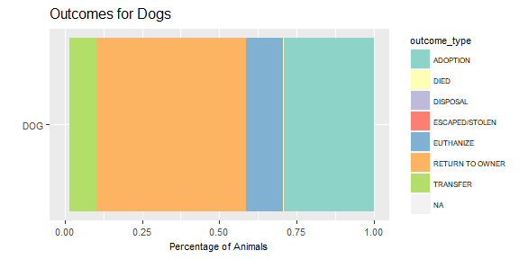
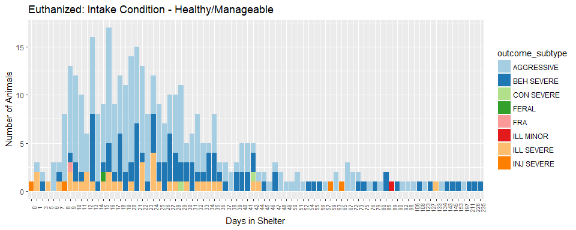
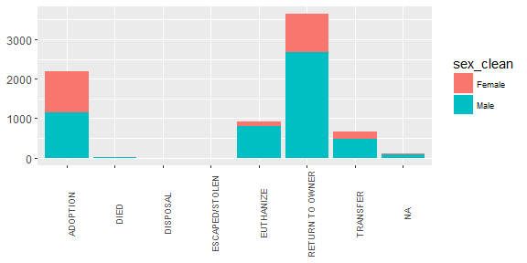
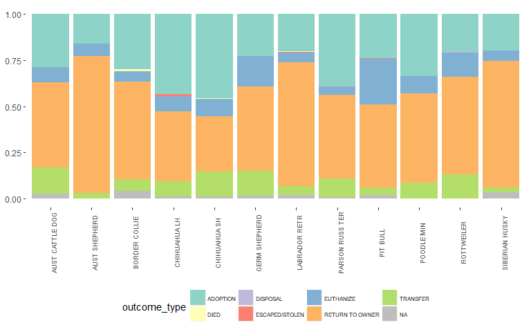

### **A STUDY ON ANIMAL SHELTER AND OUTCOMES FOR ANIMALS**

### **Background & Objectives**

According to ASPCA, approximately 6.5 million companion animals enter U.S. animal shelters nationwide every year. Among those animals, approximately 1.5 million are euthanized for different reasons. Animal rescue centers are currently facing challenges such as overpopulation, unbalanced distribution and insufficent funding support. I hope this analysis could provide insights into the factors and characteristics of the animals that affect the outcomes and help rescue centers to predict the probability of adoption and make best use of their resources for the desirable outcome.

### **The Dataset**

Sonoma County Animal Services is an animal rescue center in Santa Rosa, California. It dedicates to caring for homeless animals until they can be matched with perfect homes. It keeps a record of the [animal intake and outcome dataset](https://data.sonomacounty.ca.gov/Government/Animal-Shelter-Intake-and-Outcome/924a-vesw/data) from year 2013 to year 2018, which forms the basis for this study. A list of definition of the terms used in the dataset can be found [here](http://sonomacounty.ca.gov/Health/Animal-Services/Statistics-Definitions/).

The dataset is well organized with a few shortcomings. There are missing values in the columns such as 'size', 'outcome type', 'outcome subtype', 'outcome condition', 'outcome jurisdiction', 'zip code', and 'location'. Some of the columns are mis-represented with wrong information or meaningless values. Date columns occasionally contain future dates. The following data wrangling steps are performed to address the aforementioned issues.

### **Data Wrangling Steps**

##### **1. Load & Preparation**

``` r
library(readr)
library(tidyr)
library(dplyr)
library(lubridate)
df<-read_csv("Animal_Shelter.csv")
```

##### **2. Clean up column names by replacing space with \_ and to lowercase**

``` r
names(df) <- gsub(x = names(df), pattern = "\\ ", replacement = "_") 
names(df) <- tolower(names(df))
```

##### **3. Subset the data to include only CAT and DOG for this study's purpose**

``` r
df <- filter(df, type=="DOG" | type=="CAT")
```

##### **4. Translate Spayed and Neutered into Female & Male and create a new sex column**

``` r
df$sex_clean <- ifelse(df$sex=="Spayed", "Female", "Male")
```

##### **5. Change the date columns to Date class using lubridate**

``` r
df$date_of_birth <- mdy(df$date_of_birth)
df$intake_date <- mdy(df$intake_date)
df$outcome_date <- mdy(df$outcome_date)
```

##### **6. Clean up the DOB column to remove future dates and change missing dates to NA**

``` r
df$date_of_birth[df$date_of_birth > Sys.Date() & !is.na(df$date_of_birth)] <- NA
```

##### **7. Clean up the DOB column where DOB is later than the intake date**

``` r
df$date_of_birth[df$date_of_birth>df$intake_date & !is.na(df$date_of_birth)] <- NA
```

##### **8. Fill up the missing values in size column**

a.  make size equals Puppy or Kitten if animal is less than 1 year old upon arrival at the shelter

``` r
df$size[df$type=="CAT" & (df$intake_date-df$date_of_birth < 365) & df$size=="" & !is.na(df$date_of_birth)] <- "KITTN"
df$size[df$type=="DOG" & (df$intake_date-df$date_of_birth < 365) & df$size=="" & !is.na(df$date_of_birth)] <- "PUPPY"
```

b.  identify all the breed types where size column is NA

``` r
df$breed[is.na(df$size)]
```

    ##  [1] "AMERICAN STAFF/PIT BULL" "DOMESTIC SH"            
    ##  [3] "MCNAB"                   "GERM SHEPHERD"          
    ##  [5] "CHIHUAHUA SH/MIX"        "ROTTWEILER/MIX"         
    ##  [7] "BEAGLE"                  "CHIHUAHUA SH"           
    ##  [9] "BORDER COLLIE/MIX"       "BEAGLE"                 
    ## [11] "LABRADOR RETR/MIX"       "LABRADOR RETR"          
    ## [13] "CHIHUAHUA SH/MIX"        "AMERICAN STAFF/PIT BULL"
    ## [15] "BORDER COLLIE/MIX"       "GOLDEN RETR"            
    ## [17] "MAREMMA SHEEPDG"         "GOLDEN RETR"            
    ## [19] "PUG"                     "CHIHUAHUA SH"           
    ## [21] "AMERICAN STAFF/PIT BULL" "LABRADOR RETR"          
    ## [23] "BASSET HOUND/MIX"

c.  categorize the breed into different size classes and replace the missing values based on the breed

``` r
toy <-c("CHIHUAHUA SH")
small <- c("BEAGLE", "CHIHUAHUA SH/MIX", "DOMESTIC SH", "PUG")
med <- c("BASSET HOUND/MIX", "BORDER COLLIE/MIX", "MCNAB")
large <- c("AMERICAN STAFF/PIT BULL", "GERM SHEPHERD", "GOLDEN RETR", "LABRADOR RETR", "LABRADOR RETR/MIX", "MAREMMA SHEEPDG", "ROTTWEILER/MIX")

df$size[df$breed %in% toy & is.na(df$size)] <- "TOY"
df$size[df$breed %in% small & is.na(df$size)] <- "SMALL"
df$size[df$breed %in% med & is.na(df$size)] <- "MED"
df$size[df$breed %in% large & is.na(df$size)] <- "LARGE"
```

##### **9. Remove the number 0 from days\_in\_shelter column if the animal is still in shelter**

``` r
df$days_in_shelter[is.na(df$outcome_date)] <- NA
```

##### **10. Replace missing values in Outcome type, Outcome subtype, and Outcome condition with "Unknown"**

``` r
levels(df$outcome_type)[levels(df$outcome_type)==""] <- "UNKNOWN"
levels(df$outcome_subtype)[levels(df$outcome_subtype)==""] <- "UNKNOWN"
levels(df$outcome_condition)[levels(df$outcome_condition)==""] <-"UNKNOWN"
```

##### **11. Replace missing values in Outcome Jurisdiction, Zip Code & Location with NA/Unknown**

``` r
levels(df$outcome_jurisdiction)[levels(df$outcome_jurisdiction)==""] <- "UNKNOWN"
df$outcome_zip_code[df$outcome_zip_code==""] <- NA
df$location[df$location==""] <- NA
```

##### **12. Replace missing values in name column, default to "Nameless"**

``` r
levels(df$name)[levels(df$name)==""] <- "Nameless"
```

##### **13. Add an age\_at\_outcome column & an age\_at\_intake column**

``` r
df$age_at_outcome <- (df$outcome_date-df$date_of_birth)/365
df$age_at_intake <- (df$intake_date-df$date_of_birth)/365
```

##### **14. Remove the Count column**

``` r
df_clean <- select(df, -count)
```

##### **15. Export the clean data to csv**

``` r
write_csv(df_clean, "shelter_clean.csv")
```

Now we have the clean data. By roughly looking at the data, I'm interested to explore whether the different variables have any influence on the animal outcome and if any of them are statistically significant in predicting the outcome.

### **Statistical Analysis**

#### **Overview of the Animal Distribution**

Before I start anything, I want to examine the number of cats and dogs in the shelter.


Since the dog category has a larger sample size, for the purpose of this study, I will use the dog category for my analysis.

#### **Deep Dive into the Dog Category**

##### **1. Subset the data to include only dogs**

``` r
dogs <- filter(df_clean, type=="DOG")
```

##### **2. Outcome Types for Dogs**

Starting with the easiest question, what are the possible outcomes for the animals and what does the distribution look like?

``` r
outcome <- dogs %>% 
  group_by(type, outcome_type) %>% 
  summarise(animal_count = n())

ggplot(outcome, aes(x=type, y=animal_count, fill=outcome_type)) +
  geom_bar(stat="identity", position = "fill") +
  coord_flip() +
  labs(y = "Percentage of Animals", 
       x = "",
       title = "Outcomes for Dogs") +
  scale_fill_brewer(palette="Set3") +
  theme(legend.text = element_text(size=6),
        legend.title = element_text(size=8),
        title = element_text(size=10),
        axis.title.x = element_text(size=8),
        axis.text.y = element_text(size=8),
        axis.text.x = element_text(size=8))
```



It appears that majority of the dogs are either returned to the owners or adopted. This is a good sign for a well-operated rescue center.

##### **3. Intake Type by Outcomes**

For all dogs that go through the shelter-adoption process, intake and outcome are two curcial steps. The data offers information on both the intake type and outcome type, and I'm curious to know if there's any relationship between the two activities.

``` r
outcome_dog <- dogs %>% 
  group_by(intake_type, outcome_type) %>% 
  summarise(animal_count = n())
```

``` r
ggplot(outcome_dog, aes(x=intake_type, y=animal_count, fill=outcome_type)) +
  geom_bar(stat="identity", position = "fill") +
  coord_flip() +
  labs(y = "Percentage of Animals", 
       x = "",
       title = "Intake Type by Outcomes: DOG") +
  scale_fill_brewer(palette="Set3") +
  theme(legend.text = element_text(size=7))
```


From the above chart, we can tell that dogs from adoption return are most likely to be adopted again. Confiscated dogs are often returned to the owners. Very few dogs are returned to the owners if the owners decided to surrender the pets in the first place.

##### **4. Are healthy dogs more likely to be adopted?**

To predict the outcomes of the animals, I want to explore the factors that affect people's decision. I'll start with the health condition of the animals.

``` r
dog_condition <- dogs %>% 
  group_by(intake_condition, outcome_type) %>% 
  summarise(animal_count = n())
```

``` r
ggplot(dog_condition, aes(x = outcome_type, y = animal_count, fill = intake_condition)) +
  geom_bar(stat="identity") +
  labs(y = "Number of Animals", 
       x = "",
       title = "Outcomes by Intake Condition: DOG") +
  scale_fill_brewer(palette="Paired") +
  theme(axis.text.x = element_text(size = 7, angle = 90))
```


It is observed that majority of the dogs that are adopted or returned to owner came into the shelter with a good health condition. Dogs that came in as untreatable are mostly euthanized. However, there are still quite a few healthy/treatable dogs ended up being euthanized.

I am curious why the shelter decides to euthanize those healthy/treatable dogs and how many days do the dogs stay in the shelter before the center makes such decision?

``` r
dogs %>%
  filter(outcome_type=="EUTHANIZE") %>% 
  ggplot(aes(x = factor(days_in_shelter), fill=intake_condition)) +
  geom_bar() +
  scale_fill_brewer(palette="Paired") +
  theme(axis.text.x = element_text(size = 7, angle = 90)) +
  labs(y = "Number of Animals", 
       x = "Days in Shelter",
       title = "Euthanized Dogs by Intake Condition")
```


``` r
dogs %>%
  filter(outcome_type=="EUTHANIZE" & (intake_condition=="HEALTHY" | intake_condition=="TREATABLE/MANAGEABLE")) %>% 
  ggplot(aes(x = factor(days_in_shelter), fill=outcome_subtype)) +
  geom_bar() +
  scale_fill_brewer(palette="Paired") +
  theme(axis.text.x = element_text(size = 7, angle = 90)) +
  labs(y = "Number of Animals", 
       x = "Days in Shelter",
       title = "Euthanized: Intake Condition - Healthy/Manageable")
```



We can see that quite a few healthy/treatable dogs are euthanized between day 10 and day 30. The second chart illustrates the health condition at outcome for those dogs that came in as healthy/manageable, but ended being euthanized. It shows that there is an upsurge from day 10 to day 30 when the healthy dogs become aggressive, demonstrate severe behavior issue, or get severely ill.

At the same time, We also noticed that even though some of the animals came in as untreatable, it still takes around 30 days for them to be euthanized.

##### **5. Animal outcome vs. animal age**

Next, let's find the relationship between animal age and their outcome.

a.  add a column "stage\_at\_outcome" to indicate whether a pet is a baby, adult, or senior.

``` r
dogs$stage_at_outcome[dogs$age_at_outcome < 1] <- "baby"
```

    ## Warning: Unknown or uninitialised column: 'stage_at_outcome'.

``` r
dogs$stage_at_outcome[dogs$age_at_outcome >= 1 & dogs$age_at_outcome < 6] <- "adult"
dogs$stage_at_outcome[dogs$age_at_outcome >= 6] <- "senior"
```

b.  explore the relationship between dog stage and their outcome.

``` r
prop.table(table(dogs$outcome_type, dogs$stage_at_outcome), 1)
```

    ##                  
    ##                        adult       baby     senior
    ##   ADOPTION        0.56207055 0.32020156 0.11772790
    ##   DIED            0.36363636 0.18181818 0.45454545
    ##   DISPOSAL        1.00000000 0.00000000 0.00000000
    ##   ESCAPED/STOLEN  1.00000000 0.00000000 0.00000000
    ##   EUTHANIZE       0.64398734 0.09810127 0.25791139
    ##   RETURN TO OWNER 0.49966865 0.12193506 0.37839629
    ##   TRANSFER        0.59464286 0.16964286 0.23571429

The above chart explains to us that more adults and puppies are adopted compared to senior dogs. Most of the dogs that died are seniors. Among the dogs that are euthanized, majority are adults.

Let's take a different angle by looking at the outcomes within each age group.

``` r
prop.table(table(dogs$outcome_type, dogs$stage_at_outcome), 2)
```

    ##                  
    ##                          adult         baby       senior
    ##   ADOPTION        0.3522825151 0.5701468189 0.1512654503
    ##   DIED            0.0011484353 0.0016313214 0.0029429076
    ##   DISPOSAL        0.0005742176 0.0000000000 0.0000000000
    ##   ESCAPED/STOLEN  0.0005742176 0.0000000000 0.0000000000
    ##   EUTHANIZE       0.1168532874 0.0505709625 0.0959387875
    ##   RETURN TO OWNER 0.4329600919 0.3001631321 0.6721600942
    ##   TRANSFER        0.0956072351 0.0774877651 0.0776927604

Now we find that adult dogs are usually either adopted or returned to the owner. Puppies are mostly adopted and has the highest adoption rate among all age groups. Senior dogs are often returned to the owners and have a higher mortality rate compared to adults or puppies.

Since majority of the dogs in the shelter are either returned to the owners or adopted, I would like to see how the shelter does in terms of turnaround. I'll start with the dogs that reunited with their family.

##### **6. How long does it take for the animals to be returned to their owners?**

``` r
dogs %>% 
  filter(outcome_type=="RETURN TO OWNER") %>% 
  ggplot(aes(factor(days_in_shelter))) +
  geom_bar(fill="#3399CC")
```


Majority of the animals that are returned to the owner are returned within 1 week. The shelter is doing a good job.

Next, I would like to take a look at the adoption time.

##### **7. Among the animals that are adopted, what is the average adoption time**

``` r
dogs %>% 
  filter(outcome_type=="ADOPTION") %>% 
  summarise(avg_adoption_time = mean(days_in_shelter))
```

    ## # A tibble: 1 x 1
    ##   avg_adoption_time
    ##               <dbl>
    ## 1              33.9

Seems like that it typically takes around a month for a dog to be adopted.

``` r
dogs %>% 
  filter(outcome_type=="ADOPTION") %>% 
  ggplot(aes(x = days_in_shelter)) +
  geom_histogram(binwidth = 5, fill="#3399CC")
```


By plotting the data, we find that there are some outliers with around 800 adoption days. We can also conclude that most of the animals are adopted within 100 days, let's zoom in a bit by adding the condition days\_in\_shelter&lt;=100 days.

``` r
dogs %>% 
  filter(outcome_type=="ADOPTION" & days_in_shelter<=100) %>% 
  ggplot(aes(x = days_in_shelter)) +
  geom_histogram(binwidth = 1, fill="#3399CC")
```


Now it is more obvious that most of the animals are adopted between 5 to 50 days. Below is a statistical summary of the adoption time.

Mean

``` r
adoption <- dogs %>% 
  filter(outcome_type=="ADOPTION")
mean(adoption$days_in_shelter)
```

    ## [1] 33.8537

Standard Deviation

``` r
sd(adoption$days_in_shelter)
```

    ## [1] 45.52598

Mean and Confidence intervals

``` r
library(qwraps2)
mean_ci(adoption$days_in_shelter)
```

    ## [1] "33.85 (31.95, 35.76)"

Median and Inner Quartile Range

``` r
median_iqr(adoption$days_in_shelter)
```

    ## [1] "21 (13.00, 37.00)"

##### **8. Adoption vs. Sex**

Due to state spay and neuter law, all animals that are adopted are either spayed or neutered, but is there a difference in the adoption rate for male and female dogs?

``` r
dogs %>% 
  ggplot(aes(x = outcome_type, fill=sex_clean)) +
  geom_bar() +
  theme(axis.text.x = element_text(size = 7, angle = 90), 
        axis.title = element_blank(),
        legend.text = element_text(size=7))
```



It seems that there is an equal preference in male and female when it comes to adoption.

##### **9. Adoption vs. Breed**

I would imagine that breed is one of the factors that could have an effect on people's decision. The breed variable in the raw data contains 644 levels. To simplify the analysis, I created two columns, one to indicate whether the breed is a mix or not, and the other extracts only the first breed if the dog is a mix.

``` r
dogs$is_mix <- ifelse(grepl("MIX", dogs$breed), 1, 0)
dogs$breed <- as.character(dogs$breed)
dogs$breed_clean <- sapply(strsplit(dogs$breed, split = "/"), '[[', 1)
dogs$breed_clean <- as.factor(dogs$breed_clean)
```

``` r
ggplot(dogs, aes(x = factor(is_mix), fill=outcome_type)) +
  geom_bar(position="fill") +
  scale_fill_brewer(palette="Set3") +
  theme(legend.text = element_text(size=7))
```


By comparing whether the dog is mixed or purebred, I am a bit surprised that there is no significant difference in terms of outcomes.

How about the most common type of dogs that are accepted?

``` r
dogs %>% 
  group_by(breed_clean) %>% 
  mutate(Len = n()) %>% 
  filter(Len >= 100) %>% 
  ggplot(aes(x = breed_clean, fill=outcome_type)) +
  geom_bar() +
  theme(axis.text.x = element_text(size=7, angle=90), 
        axis.title = element_blank(),
        legend.text = element_text(size=6),
        legend.position = "bottom") +
  scale_fill_brewer(palette="Set3")
```


The plot reveals that Chihuahua SH is the most commonly adopted dog, followed by Pit Bull, German Shepherd, and Labrador Retriever.

``` r
dogs %>% 
  group_by(breed_clean) %>% 
  mutate(Len = n()) %>% 
  filter(Len >= 100) %>% 
  ggplot(aes(x = breed_clean, fill=outcome_type)) +
  geom_bar(position="fill") +
  theme(axis.text.x = element_text(size=7, angle=90), 
        axis.title = element_blank(),
        legend.position = "bottom",
        legend.text = element_text(size=6)) +
  scale_fill_brewer(palette="Set3")
```



If we take a look at the proportion of each outcome type, we can see that of all the common dog types to appear in the shelter, Pit Bulls are the most likely to be euthanized, while they're only the eighth most likely to be adopted.

After toggling among the different factors, I came to the conclusion that the following variables could be valuable to predict the animal outcomes.

-   size
-   stage\_at\_outcome (age)
-   sex
-   breed
-   intake\_condition
-   outcome\_condition

### **Machine Learning and Prediction**

For this report's purpose, the prediction will be made around dogs, and the predicted value will be the outcome of each animal. I will use GBM for the prediction and the outcome will be a binary classification. The outcomes for the animals will be either "placed in a home" or "not placed in a home". "Adoption" and "Return to owner" will be regarded as "placed in a home", and all others will be categorized into "not place in a home". To do so, I will add a column "placed" and the binary value for the column will be 1 or 0.

``` r
dogs$placed <- ifelse((dogs$outcome_type == "ADOPTION" | dogs$outcome_type == "RETURN TO OWNER"), 1, 0)
```

Some of the columns have a class of "character" or "timediff". In order for the prediction model to work, update those columns to either "factors" or "numeric". Some of the dogs are recently accepted into the rescue center and are still in the adoption process. We need to remove those entries since the outcome decision hasn't been made yet.

``` r
cols <- c("size","intake_condition","outcome_condition", "sex_clean", "stage_at_outcome")
dogs[cols] <- lapply(dogs[cols], factor)
dogs$age_at_intake <- as.numeric(dogs$age_at_intake)
dogs <- dogs[!is.na(dogs$outcome_type),]
```

##### **Prediction Using GBM**

1.  Separate the dataframe into a training and a testing set. 80% of data will be in training set and the rest 20% will be in testing set.

``` r
n <- nrow(dogs)
n_train <- round(n * 0.8)
set.seed(123)
train_indices <- sample(1:n, n_train)
dog_train <- dogs[train_indices, ]
dog_test <- dogs[-train_indices, ]
```

1.  Create the GBM model

``` r
library(gbm)
set.seed(1)
dog_model_gbm <- gbm(formula = placed ~ size + intake_condition + outcome_condition + sex_clean + age_at_intake + stage_at_outcome + is_mix,
                             distribution = "bernoulli",
                             data = dog_train,
                             n.trees = 10000)
```

1.  Predict the outcomes of the test set

``` r
pred_gbm <- predict(object = dog_model_gbm, 
                newdata = dog_test,
                n.trees = 10000,
                type = "response")
```

1.  Evaluate the model using test set AUC

``` r
library(Metrics)
auc <- auc(actual=dog_test$placed, predicted=pred_gbm)
print(paste0("Test set AUC: ", auc))
```

    ## [1] "Test set AUC: 0.876466407843653"

### **Conclusion and Outlook**

Our variables did a reasonable job in predicting the results with a test set AUC of around 0.88. We can fairly conclude that certain attributes of the dogs such as size, age, and breed are influential in people's decision on adoption. With these known factors, animal shelters can make a quick judgement at the time of the intake to identify the dogs that are at a higher risk of being ignored. It is worth considering to come up with certain solutions which could increase the adoption rate for those animals. With the current technology disruption, improvements are possible. We could increase the exposure for those overlooked dogs, have a better placement solution for the dogs that come in with health or behavior problem, and further enhance the adoption cycle. In our data clean up step, we noticed that some of the information are mistyped. This could due to the manual input of data. Would an automated process help increase the accuracy and decrease labor cost? There are a lot to think about explore for future work.
