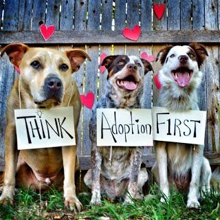
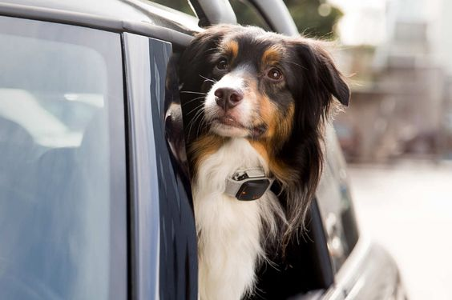
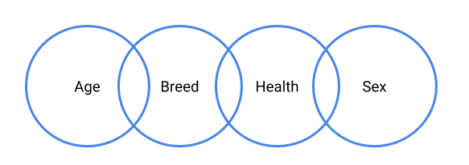
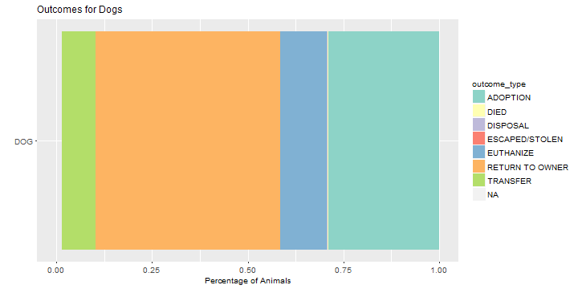
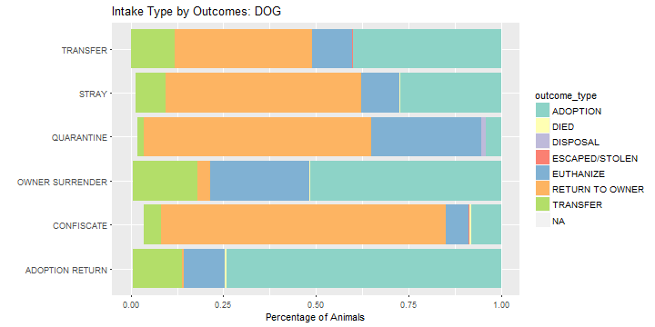
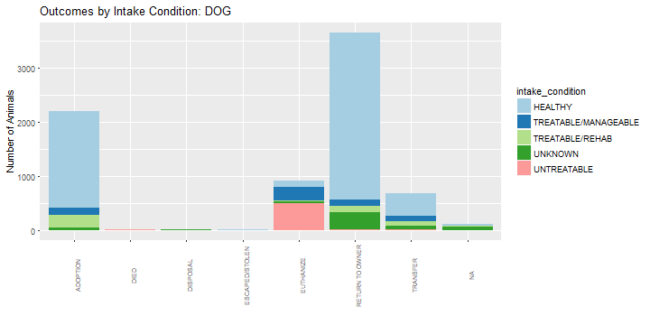
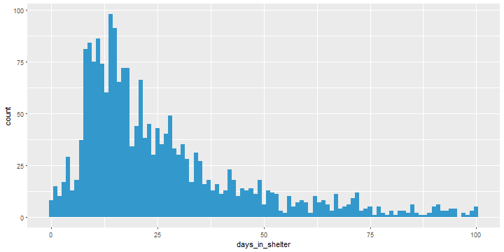

Animal Shelter Presentation - Adopt Not Shop
========================================================
author: Irene Yao
date: May 10, 2018
autosize: true
font-import: http://fonts.googleapis.com/css?family=Roboto
font-family: 'Roboto'

<div align="left">

</div>

Animal Adoption Fact Sheet
========================================================

### **6.5 million: number of animals entering shelters every year**
### **3-4 million: number of pets adopted from shelters every year**
### **1.5 million: number of animals euthanized every year**
### **20% - 30%: number of pet owners that choose to adopt**

<div align="left">

</div>

Study Purpose
========================================================
* provide insights into the factors that affect the outcomes
* help rescue centers to predict the probability of adoption
* bring suggestions to better utilize resources
* have more animals adopted!!

# **Let the study begin**

Data Source and Intuition
========================================================
* Data - [animal intake and outcome dataset](https://data.sonomacounty.ca.gov/Government/Animal-Shelter-Intake-and-Outcome/924a-vesw/data). Source: Sonoma County website
* Definition of the variables - http://sonomacounty.ca.gov/Health/Animal-Services/Statistics-Definitions/

What might affect people's decision in adoption?

<div align="left">

</div>
Let's see what happens in the dog world? 

What's up with the dogs? - Outcome Types
========================================================




Majority of the dogs are either returned to the owners or adopted!

Is intake type associated with the outcome?
========================================================




* Dogs from adoption return are most likely to be adopted again
* Confiscated dogs are often returned to the owners
* Very few dogs are returned to the owners if the owners decided to surrender the pets in the first place. 

Are healthy dogs more likely to be adopted?
========================================================




* Adopted dogs are ususally in good health
* Dogs that came in as untreatable are mostly euthanized

Are healthy dogs more likely to be adopted?
========================================================


* Adopted dogs are ususally in good health
* Dogs that came in as untreatable are mostly euthanized

Are puppies more welcomed?
========================================================


```
                 
                       adult       baby     senior
  ADOPTION        0.56207055 0.32020156 0.11772790
  DIED            0.36363636 0.18181818 0.45454545
  DISPOSAL        1.00000000 0.00000000 0.00000000
  ESCAPED/STOLEN  1.00000000 0.00000000 0.00000000
  EUTHANIZE       0.64398734 0.09810127 0.25791139
  RETURN TO OWNER 0.49966865 0.12193506 0.37839629
  TRANSFER        0.59464286 0.16964286 0.23571429
```

* More adults and puppies are adopted compared to senior dogs
* Most of the dogs that died are seniors
* Among the dogs that are euthanized, majority are adults.  

Are puppies more welcomed?
========================================================


```
                 
                       adult       baby     senior
  ADOPTION        0.56207055 0.32020156 0.11772790
  DIED            0.36363636 0.18181818 0.45454545
  DISPOSAL        1.00000000 0.00000000 0.00000000
  ESCAPED/STOLEN  1.00000000 0.00000000 0.00000000
  EUTHANIZE       0.64398734 0.09810127 0.25791139
  RETURN TO OWNER 0.49966865 0.12193506 0.37839629
  TRANSFER        0.59464286 0.16964286 0.23571429
```

* More adults and puppies are adopted compared to senior dogs
* Most of the dogs that died are seniors
* Among the dogs that are euthanized, majority are adults. 

How's the shelter doing?
========================================================
The average adoption time is 33.85 days. 



Most of the animals are adopted between 5 to 50 days. 
* Standard deviation: 45.53 days
* Median adoption time: 21 days
* Inner quartile range: 13 - 37 days
