#### **Overview of the Animal Distribution**

##### **1. Load ggplot2**

``` r
library(ggplot2)
```

##### **2. Number of cats vs. dogs in the shelter**

Before I start anything, I want to examine the number of cats and dogs in the shelter.

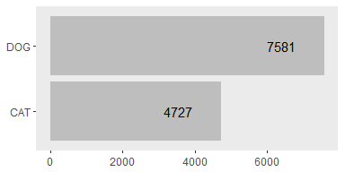

Since the dog category has a larger sample size, I will use the dog category for my analysis.

##### **3. Intake & Outcome percentage by animal type**

Before I separate the data into DOG and CAT subsets, I'm interested to see how cats and dogs are different in terms of intake and outcome type.

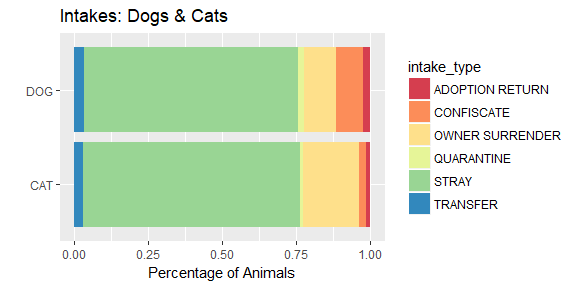

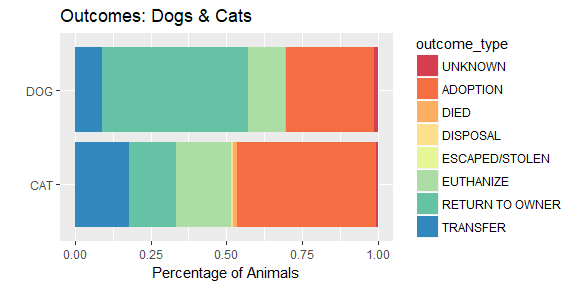

Observation: Most of the dogs and cats are taken into the shelter as stray animals. Cats have a higher adoption rate than dogs, and most of the dogs are returned to the owners. It also appears that cats are more likely to be transferred to other shelters than dogs.

#### **Deep Dive into the Dog Category **

##### **1. Subset the data to include only dogs**

``` r
dogs <- filter(df_clean, type=="DOG")
```

##### **2. Intake Type by Outcomes**


Observation: Dogs from adoption return are most likely to be adopted again. Confiscated dogs are often returned to the owners. Very few dogs are returned to the owners if the owners decided to surrender the pets in the first place.

##### **3. Are healthy dogs more likely to be adopted?**

To predict the outcomes of the animals, I want to explore the factors that affect people's decision. I'll start with the health condition of the animals.

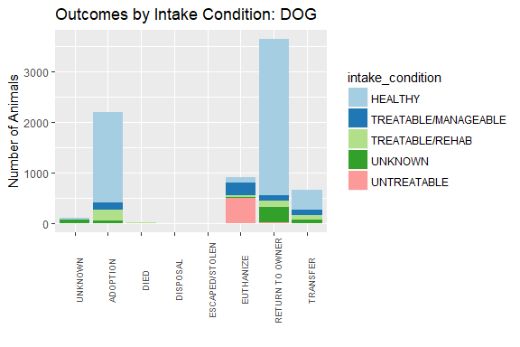

Observation: Majority of the dogs that are adopted or returned to owner came into the shelter with a good health condition. Dogs that came in as untreatable are mostly euthanized. However, there are still quite a few healthy/treatable dogs ended up being euthanized.

I am curious why the shelter decides to euthanize those healthy/treatable dogs and how many days do the dogs stay in the shelter before the shelter makes such decision?

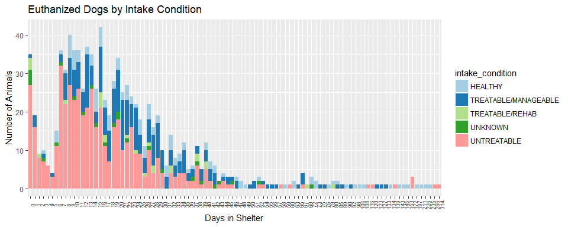


We can see that quite a few healthy/treatable dogs are euthanized between day 10 and day 30. The second chart illustrates the health condition at outcome for those dogs that came in as healthy/manageable, but ended being euthanized. It shows that there is an upsurge from day 10 to day 30 when the healthy dogs become aggressive, demonstrate severe behavior issue, or get severely ill.

At the same time, We also noticed that even though some of the animals came in as untreatable, it still takes around 30 days for them to be euthanized.

##### **4. Animal outcome vs. animal age**

Next, let's find the relationship between animal age and their outcome.

1.  add a column "stage\_at\_outcome" to indicate whether a pet is a baby, adult, or senior.

``` r
dogs$stage_at_outcome[dogs$age_at_outcome < 1] <- "baby"
dogs$stage_at_outcome[dogs$age_at_outcome >= 1 & dogs$age_at_outcome < 6] <- "adult"
dogs$stage_at_outcome[dogs$age_at_outcome >= 6] <- "senior"
```

1.  explore the relationship between dog stage and their outcome.

<!-- -->

    ##                  
    ##                        adult       baby     senior
    ##   UNKNOWN                                         
    ##   ADOPTION        0.56207055 0.32020156 0.11772790
    ##   DIED            0.36363636 0.18181818 0.45454545
    ##   DISPOSAL        1.00000000 0.00000000 0.00000000
    ##   ESCAPED/STOLEN  1.00000000 0.00000000 0.00000000
    ##   EUTHANIZE       0.64398734 0.09810127 0.25791139
    ##   RETURN TO OWNER 0.49966865 0.12193506 0.37839629
    ##   TRANSFER        0.59464286 0.16964286 0.23571429

Observation: More adults and puppies are adopted compared to senior dogs. Most of the dogs that died are seniors. Among the dogs that are euthanized, majority are adults.

Let's take a different angle by looking at the outcomes within each age group.

    ##                  
    ##                          adult         baby       senior
    ##   UNKNOWN         0.0000000000 0.0000000000 0.0000000000
    ##   ADOPTION        0.3522825151 0.5701468189 0.1512654503
    ##   DIED            0.0011484353 0.0016313214 0.0029429076
    ##   DISPOSAL        0.0005742176 0.0000000000 0.0000000000
    ##   ESCAPED/STOLEN  0.0005742176 0.0000000000 0.0000000000
    ##   EUTHANIZE       0.1168532874 0.0505709625 0.0959387875
    ##   RETURN TO OWNER 0.4329600919 0.3001631321 0.6721600942
    ##   TRANSFER        0.0956072351 0.0774877651 0.0776927604

Observation: Adult dogs are usually either adopted or returned to the owner. Puppies are mostly adopted and has the highest adoption rate among all age groups. Senior dogs are often returned to the owners and have a higher mortality rate compared to adults or puppies.

Since majority of the dogs in the shelter are either returned to the owners or adopted, I would like to see how the shelter does in terms of turnaround. I'll start with the dogs that reunited with their family.

##### **5. How long does it take for the animals to be returned to their owners?**


Observation: Majority of the animals that are returned to the owner are returned within 1 week. The shelter is doing a good job.

Next, I would look at the adoption time.

##### **6. Among the animals that are adopted, what is the average adoption time**

    ##   avg_adoption_time
    ## 1           33.8537

Seems like that it typically takes around a month for a dog to be adopted.

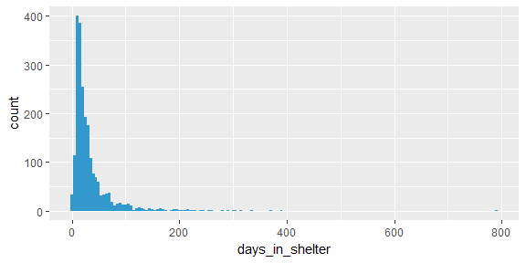

By plotting the data, we find that there are some outliers with around 800 adoption days. We can also conclude that most of the animals are adopted within 100 days, let's zoom in a bit by adding the condition days\_in\_shelter&lt;=100 days.

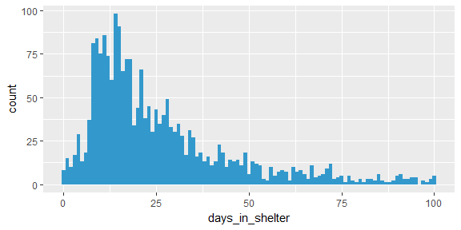

Now we can see that actually most of the animals are adopted between 5 to 50 days. Below is a statistical summary of the adoption time.

Mean

    ## [1] 33.8537

Standard Deviation

    ## [1] 45.52598

Mean and Confidence intervals

    ## [1] "33.85 (31.95, 35.76)"

Median and Inner Quartile Range

    ## [1] "21 (13.00, 37.00)"

##### **6. Adoption vs. Sex**

Due to state spay and neuter law, all animals that are adopted are either spayed or neutered, but is there a difference in the adoption rate for male and female dogs?

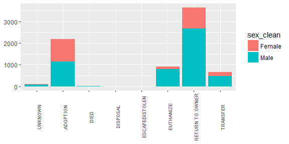

Observation: There is an equal preference in male and female when it comes to adoption.

##### **6. Adoption vs. Breed**

The breed variable in the raw data contains 644 levels. To simplify the analysis, I created two columns, one to indicate whether the breed is a mix or not, and the other extracts only the first breed if the dog is a mix.

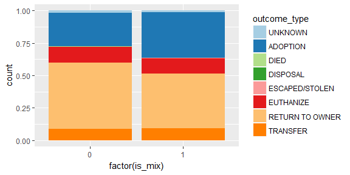

By comparing whether the dog is mixed or purebred, we can see that there is no significant difference in terms of outcomes.

How about the most common type of dogs that are accepted?

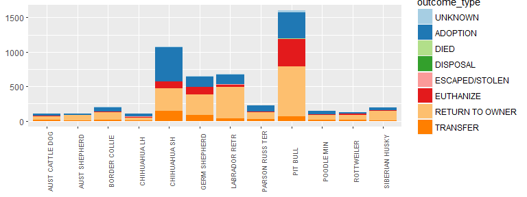

We can learn from the plot that Chihuahua SH is the most commonly adopted dog, followed by Pit Bull, German Shepherd, and Labrador Retriever.

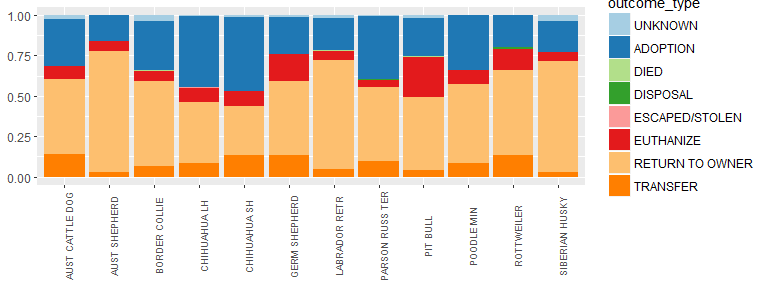

If we take a look at the proportion of each outcome type, we can see that of all the common dog types to appear in the shelter, Pit Bulls are the most likely to be euthanized, while they're only the eighth most likely to be adopted.

Based on the above analysis, we will use the following variables for prediction of outcome type.

-   stage\_at\_outcome (age)
-   days in shelter
-   sex
-   breed
-   intake\_condition
